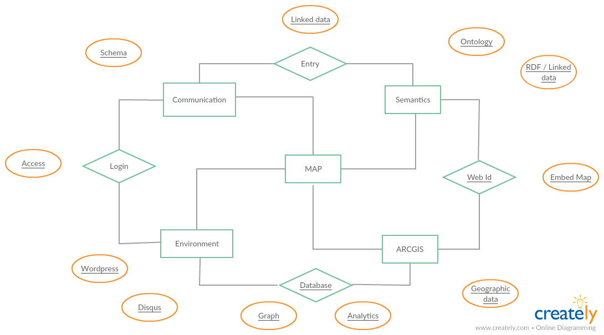

Site details
============

The project architecture is visualized:

The plugins currently in use: 

- Akismet Anti-Spam

Used by millions, Akismet is quite possibly the best way in the world to protect your blog from spam. It keeps your site protected even while you sleep. To get started: activate the Akismet plugin and then go to your Akismet Settings page to set up your API key. Version 4.0.1 

- Disqus Comment System
	
The Disqus comment system replaces your WordPress comment system with your comments hosted and powered by Disqus. Head over to the Comments admin page to set up your Disqus Comment System. Version 2.87 

- Embed Webmap

Embed a public webmap from ArcGIS Online into WordPress with a shortcode. http://gavinr.com/embed-webmap-plugin for help and details. Version 2.0.1 

- Heateor Social Comments
	
Enable Facebook Comments, Google Plus Comments, Disqus Comments along with default WordPress Comments Version 1.4.12 

- Schema

The next generation of Structured Data. Version 1.6.9.7 

- SQL Executioner
	
Execute SQL commands on your WordPress database. Goto Tools > SQL Executioner to operate. Version 1.4 	

- Vectr

Vectr description Version 1.0.0 
	
- WP Statistics

Complete statistics for your WordPress site. Version 12.1.3. 

- wp-linked-data

Publishing blog contents as linked data Version 0.3.

Disqus Comment System
---------------------
Main pages:

- https://disqus.com/api/docs/
- https://help.disqus.com/customer/portal/articles/684744
- https://help.disqus.com/customer/portal/articles/236206
- https://help.disqus.com/customer/en/portal/articles/1264625-getting-started

Embed Webmap
------------
Build as a plugin for ARCGIS maps.

Embed webmap blugin (embed [webmap id="52475e6edb18471780858627b40460c2"]) from source URL ( https://developers.arcgis.com/applications/15677178af9a4808961d957cc21064d3 ).
	
Shortcode Options:

- id: The webmap ID of the map you wish to embed. Get this from the URL bar on arcgis.com. See the “Screenshots” page for help. Example: [webmap id=”52475e6edb18471780858627b40460c2″]
- extent: in the “shortened” form. Use http://psstl.esri.com/apps/extenthelper/ for help. Example: [webmap extent=”-159.3635,7.093,-45.8967,63.7401″]
- height: specify the height, in pixels. Example: [webmap height=”600″]
- width: specify the width, in pixels. Example: [webmap width=”230″]
- zoom: Include zoom buttons. Example: [webmap id=”52475e6edb18471780858627b40460c2″ zoom]
- home: Include a home button. If this is included, the zoom buttons will automatically be included.  Example: [webmap id=”52475e6edb18471780858627b40460c2″ home]
- scale: Include a scale bar. Example: [webmap scale id=”52475e6edb18471780858627b40460c2″]
- legend: Include a legend button. Example: [webmap id=”52475e6edb18471780858627b40460c2″ legend]
- search: Include a location search textbox. Example: [webmap id=”52475e6edb18471780858627b40460c2″ search]
- searchextent: When using ‘search’ (above), only search the current extent. Example: [webmap id=”52475e6edb18471780858627b40460c2″ search searchextent]
- basemap_toggle: Show a basemap toggle. Must also include ‘alt_basemap’ to indicate alternate basemap that will show when the toggle button is clicked. Example: [webmap id=”52475e6edb18471780858627b40460c2″ basemap_toggle alt_basemap=”streets”]
- Basemap_gallery: Include a basemap menu. [webmap id=”52475e6edb18471780858627b40460c2″ basemap_gallery]
- view-larger-link: Include a link below the map to view the map in a larger window. Example: [webmap id=”52475e6edb18471780858627b40460c2″ view-larger-link]
- disable_scroll: When the mouse is over the map, the scroll will not zoom the map if this is added. Example: [webmap id=”52475e6edb18471780858627b40460c2″ 
- disable_scroll]: details – Show the map details pane. Example: [webmap id=”52475e6edb18471780858627b40460c2″ details]

